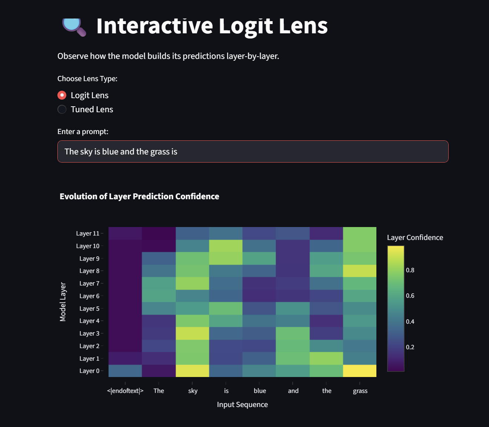
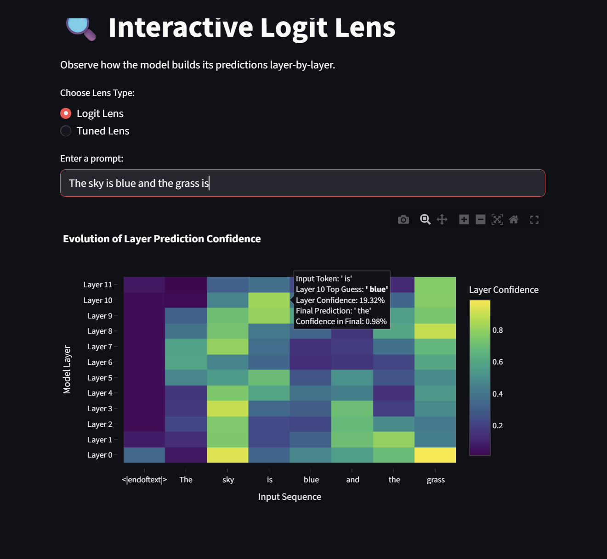
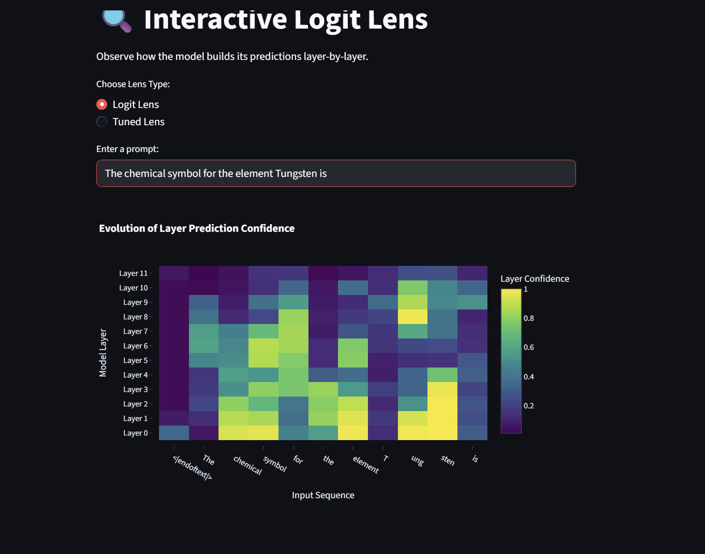
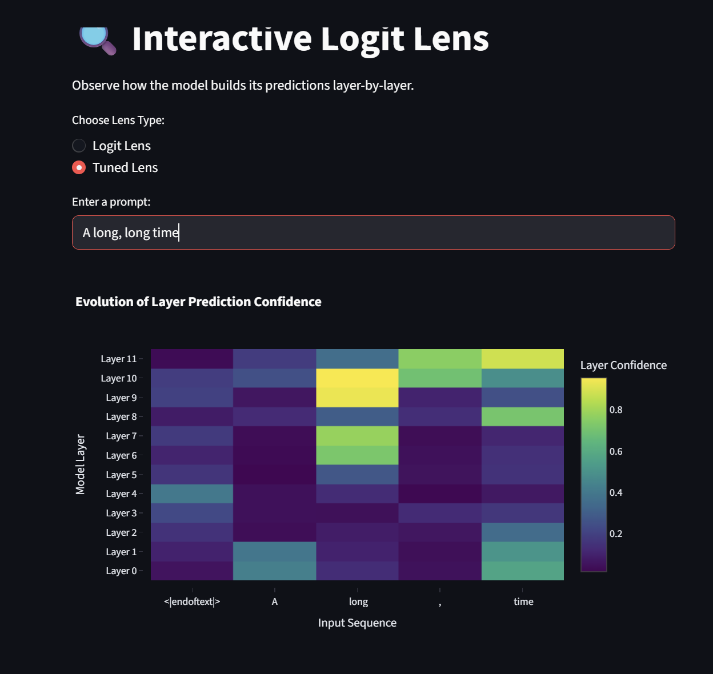
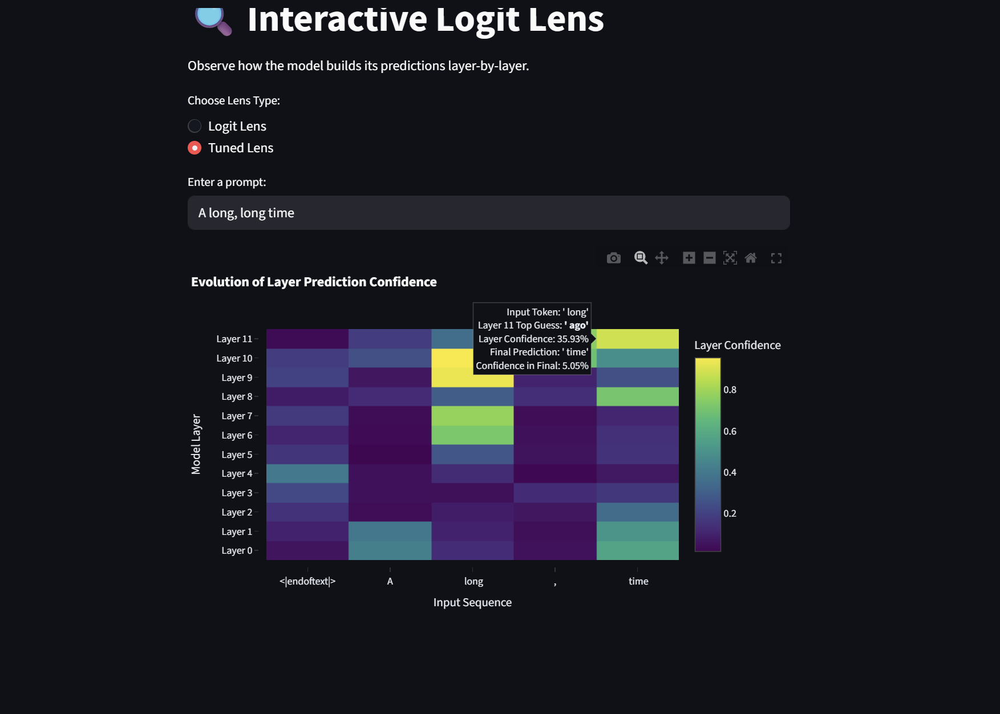

# Results for Michael

## LogitLens

### Full Heatmap


### Zoomed-In Region



### Failure Case



### Analysis
Predictions generally sharpen with depth when well-behaved. Earlier layers always have diffuse distributions and rarely have more than a single high-confidence value, of which are usually bad answers. In later layers, it would be wrong to say it's usually any better, but it can be! When it is, we have higher-confidence predictions on a few tokens since there's more time for computation and later layers are refining the earlier predictions.

Early predictions are consistently wrong and unstable. This really just means that the intermediate layers aren't aligning with the output we would like to see.

Logit lens is useful because it allows us to "look under the hood" layer-by-layer without having to train the model. It reveals when predictions occur, or when a token dominates confidence. You can also see late corrections and early mispredictions, which can aid in debugging.

Logit lens has a few problems, though. Unembedding doesn't make a lot of sense early, since the residual stream at a given layer isn't reflecting the final logit. Further, due to the initial randomization of parameters, early wrong guesses don't mean anything and don't necessarily reflect and actual computed answer. Further, just because we see a token early, and just because it stays for a while, doesn't mean it's the model's decision. It might still come out of left field with some beautiful, grammatically-correct 99% confidence answer on the last layer. These limitations suggest that the issue isn't necessarily the absence of predictive information early on but rather that the information isn't accesible until the final output.

## Tuned Lens

### Full heatmap



### Zoomed-In Region



### Analysis

We see the correct tokens emerging with non-trivial probability a little earlier in Tuned Lens when compared to Logit Lens. This might mean that information exists earlier than the logit lens suggests. We also see smoother layer-to-layer transitions in token probability, maybe because the learned nature of the projections align better with the final result. Further, there is just less noise for the earlier layers, and the top 5 tokens stay more stable than they did in the logit lens.

Tuned Lens is useful because it corrects the misalignment in logit lens by having layer-specific linear maps that approximate the decoding back into tokens. It more accurately shows the intermediate computation and reveals earlier structure. Also, with less noisy signals we can do more interpretability with it.

It still only uses linear transformations which I have to image are limiting in some way in terms of the model's ability to approximate. Further, it requires training which just takes some energy and time that you didn't have to spend with the logit lens. Also, there might be an overfitting concern with all the training that's going on, it might just be picking up on some patterns. Also, just because we can see tokens earlier with less noise doesn't mean that the model is actually getting closer to deciding that token earlier.

Basically, these results are suggesting that information is distributed across layers, but it isn't all accessible. The logit lens provides a simple, miscalibrated view, while the tuned lens provides an improved view with additional assumptions and compute.

# LogitLens
A web-based interactive tool to visualize how Large Language Models build their predictions layer-by-layer, built with Streamlit, Plotly, and TransformerLens.

This tool implements both **Logit Lens** and **Tuned Lens** techniques for LLM interpretability:
- **Logit Lens**: Interrupts the forward pass at intermediate layers, applies final layer normalization and unembedding to reveal what the model "thinks" the next word will be.
- **Tuned Lens**: A custom implementation that trains linear probes at each layer to predict the final logits from intermediate representations, providing better-calibrated predictions.

## Setup and Start

This project uses [uv](https://docs.astral.sh/uv/). Install if you haven't already:

```bash
# On macOS and Linux.
curl -LsSf https://astral.sh/uv/install.sh | sh

# On Windows
powershell -ExecutionPolicy ByPass -c "irm https://astral.sh/uv/install.ps1 | iex"
```

### Installation & Running
```bash
git clone https://github.com/nathanhoehndorf/LogitLens.git
cd LogitLens

uv run streamlit run interface.py
```

## How to Use
1. **Choose Lens Type:** Select between "Logit Lens" or "Tuned Lens" using the radio buttons.
2. **Enter a Prompt:** Type an incomplete sentence into the text box (e.g., "The capital of France is").
3. **Wait for Inference:** App downloads GPT-2 model and runs the forward pass.
4. **Explore the Heatmap:**
    - The **X-axis** represents the input tokens.
    - The **Y-axis** represents the layers of the model.
    - Hover over any cell to see the top predicted word at that specific layer and its confidence score.

## Model
The tool uses GPT-2, which has pre-trained tuned lenses available for more accurate interpretability.

## Tools Used
`TransformerLens`, `Streamlit`, `Plotly`, and `uv`.
