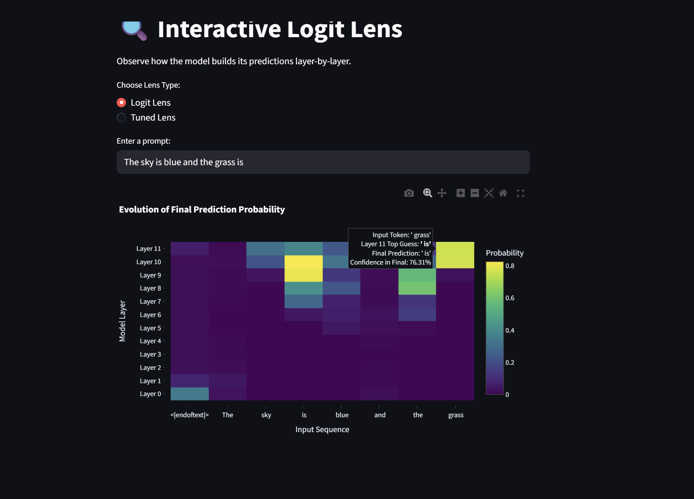
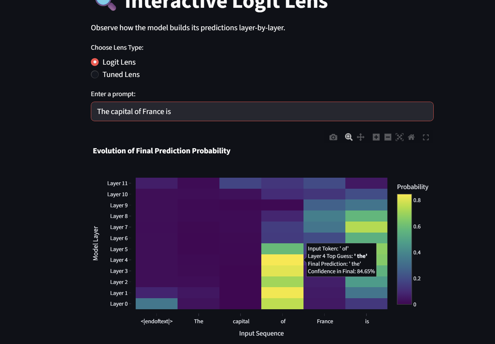
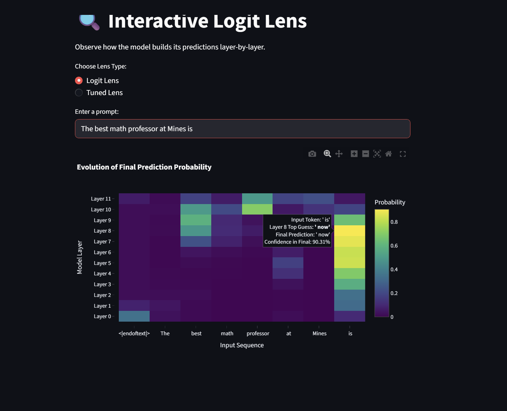
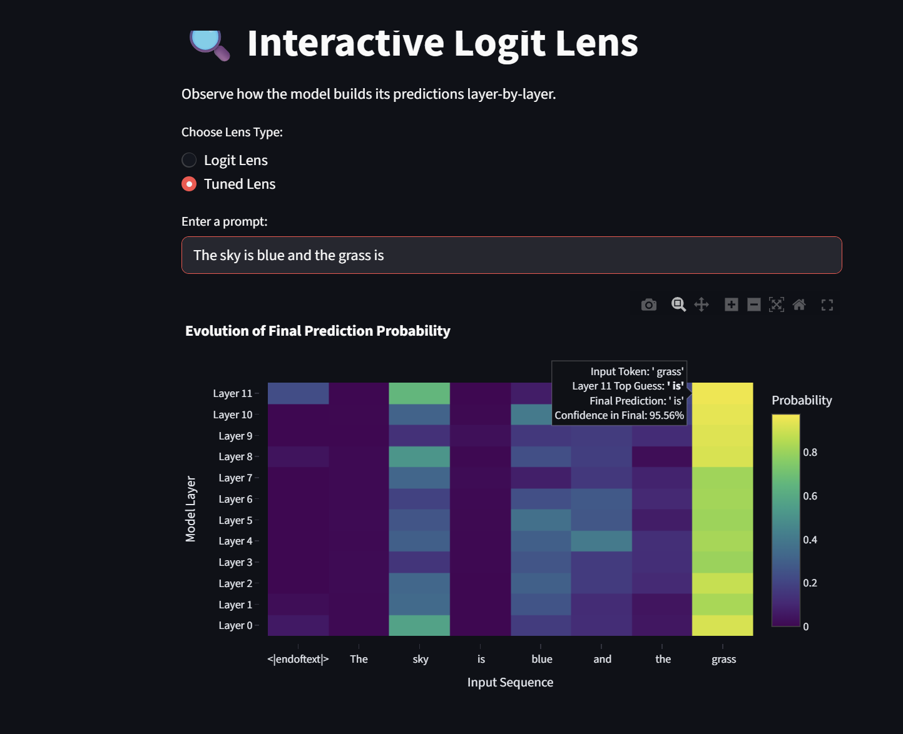
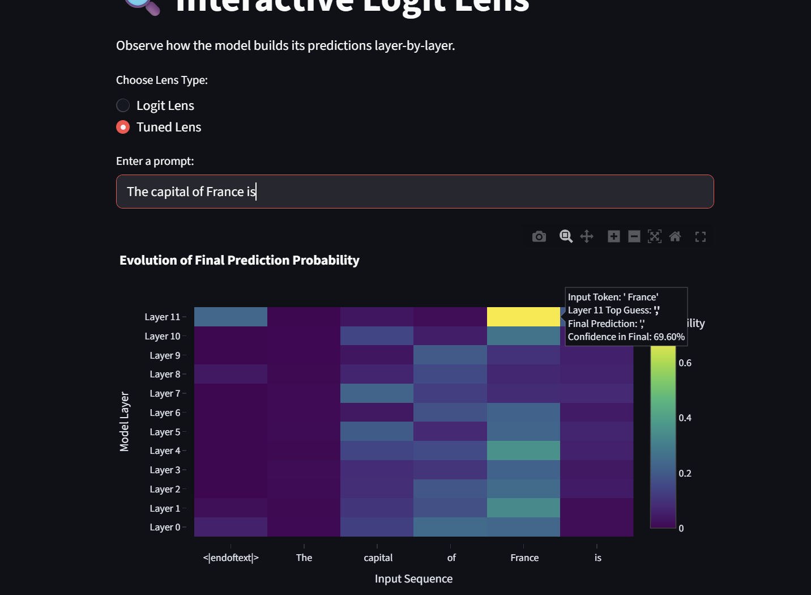
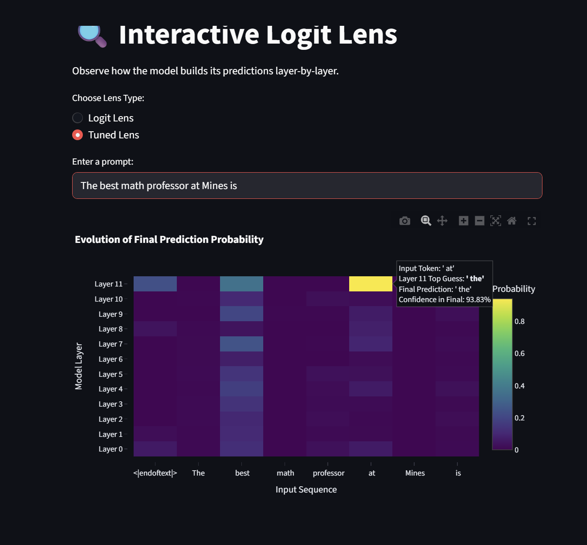

# Results for Michael

## LogitLens

**Implementation:** Extracts intermediate predictions by directly unembedding the residual stream at each layer. For each layer, we extract the residual stream from the cache at `blocks.{layer}.hook_resid_post`, apply the model's final layer normalization, project to vocabulary space with the unembedding matrix, and track the probability of the model's final prediction. This method is fast and requires no training, but doesn't account for representational drift between layers.



We see that we start getting some higher confidences in the next token prediction as the layers go up, and the model gets pretty darn sure that "grass" gets followed by "is".



The model actually starts to lose some confidence as time goes on, but multiple tokens starting having higher confidence in the later layers, if only by 10%. I thought it was interesting that the model liked "of the" at the beginning and then lost it more towards the end, since "of the" is probably a pretty common phrase in English.



Pythia liked "is now" even more than it liked "of the", for a while. We are still seeing the increase in confidence across the token and across the layers that we want, though. No, I will no divulge my opinion to the question.

## Tuned Lens

**Implementation:** A custom implementation with trainable linear probes at each layer. The approach creates one `nn.Linear(d_model, d_vocab)` probe per layer, trained via soft cross-entropy loss against the model's own final probability distribution. During training on sample sentences, each probe learns to minimize `-∑(P_final * log(P_probe))`, enabling it to account for representational drift and learn meaningful layer-wise transformations. Trained on 10 sample texts for 10 epochs, the probes output calibrated logits that surface how confidence evolves across layers.



It caught on to the fact that the sky is something, but it didn't learn anything about grass. No colors showed up in the top predictions for is, which I thought was interesting.



We actually see a somewhat reversed effect here, where most tokens actually get less confident as time goes on, with the exception of France. I thought it was cool that it predicted a comma would come next with high confidence, since every reference to France at a certain time would be formatted like France, 19XX or something. However, I feel like that doesn't show up enough for it to be >80% sure every single layer. 



Besides a single confident guess of "at the" at the very end, the only confidence above 15% was the guess of "best way" at every layer.

# LogitLens
A web-based interactive tool to visualize how Large Language Models build their predictions layer-by-layer, built with Streamlit, Plotly, and TransformerLens.

This tool implements both **Logit Lens** and **Tuned Lens** techniques for LLM interpretability:
- **Logit Lens**: Interrupts the forward pass at intermediate layers, applies final layer normalization and unembedding to reveal what the model "thinks" the next word will be.
- **Tuned Lens**: A custom implementation that trains linear probes at each layer to predict the final logits from intermediate representations, providing better-calibrated predictions.

## Setup and Start

This project uses [uv](https://docs.astral.sh/uv/). Install if you haven't already:

```bash
# On macOS and Linux.
curl -LsSf https://astral.sh/uv/install.sh | sh

# On Windows
powershell -ExecutionPolicy ByPass -c "irm https://astral.sh/uv/install.ps1 | iex"
```

### Installation & Running
```bash
git clone https://github.com/nathanhoehndorf/LogitLens.git
cd LogitLens

uv run streamlit run interface.py
```

## How to Use
1. **Choose Lens Type:** Select between "Logit Lens" or "Tuned Lens" using the radio buttons.
2. **Enter a Prompt:** Type an incomplete sentence into the text box (e.g., "The capital of France is").
3. **Wait for Inference:** App downloads GPT-2 model and runs the forward pass.
4. **Explore the Heatmap:**
    - The **X-axis** represents the input tokens.
    - The **Y-axis** represents the layers of the model.
    - Hover over any cell to see the top predicted word at that specific layer and its confidence score.

## Model
The tool uses GPT-2, which has pre-trained tuned lenses available for more accurate interpretability.

## Tools Used
`TransformerLens`, `Streamlit`, `Plotly`, and `uv`.
